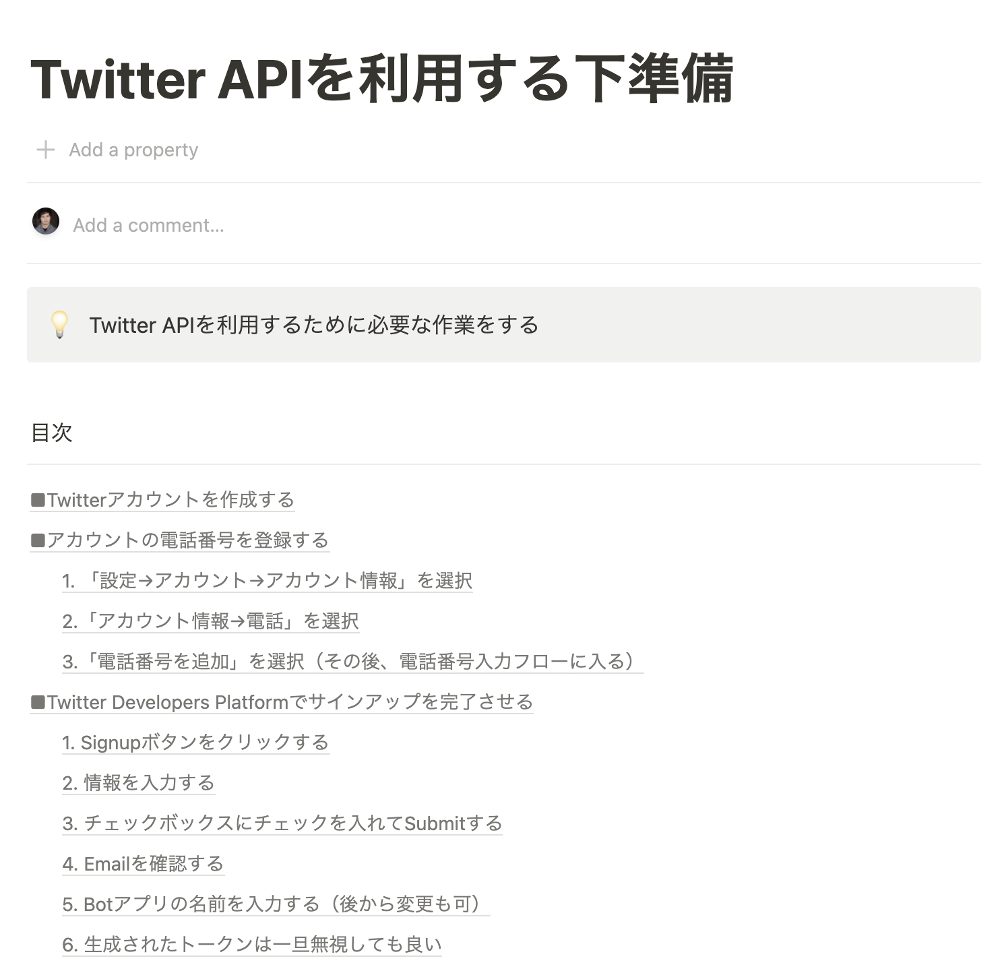

## 概要

「Twitter Bot 開発講座（TypeScript × Firebase × Twitter API）」用に作成した GitHub レポジトリ

講座の概要は以下のページまとめています。

https://tsuyoshi.notion.site/6dd508e63b2a4c70b21a486bae535ec0

## 解説資料のもらい方

解説資料はメールでお渡ししています。
以下リンク先のフォームよりメール登録が完了すると、解説資料のリンクを送られてきます。

[解説資料受け取りフォーム](https://automation001.jp/p/r/Zksi5egk)

登録者が多かった場合は、オンライン or オフラインでの勉強会も考えています。

以下の項目に 1 つでも当てはまる場合は、ぜひ解説資料を受け取っていただけたらと思います。

- 解説資料だけ受け取りたい
- 資料の更新連絡を受け取りたい
- 勉強会開催されるなら参加した
- 勉強会に参加できるかわからないけど興味がある

[解説資料受け取りフォーム](https://automation001.jp/p/r/Zksi5egk)

---

**■追加コンテンツ（2022年2月16日に追加）**

解説動画を4本追加しました。

最初の1本目は一般公開しているので、「とりあえず最初の動画を観たい」という方は以下からご覧ください。

https://youtu.be/N9HGD8ahklg

残り3本の動画は限定公開で、テキスト資料と一緒にお受け取りいただけます。

---

### 解説ページの目次をスクショしたもの

どんな解説資料が受け取れるのか、解説資料の目次部分をスクリーンショットしたものを以下に貼っておきます。

・1. ページの全体像

---

・2. Twitter API を利用する下準備

---

・3. Twitter bot 用の Firebase プロジェクトを作る

---

・4. トークン取得用の関数を実装する（Cloud Functions）

---

・5. ツイートを行う関数を実装する

---

・6. 自動ツイートを定期実行する

